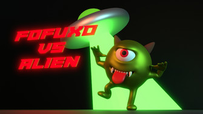

# Fofuxo Vs Alien 

.

VR game developed during the 2024 Global Game Jam on the São Luís site | SebraeLab.

Link to the Game Page: 

## Team

Antonio Froz
Sasha Nicholas
Wallas Santos

## Technologies

- Developed with Unreal Engine 5.2.1
- Tested on Meta Quest 2

## Install

To proper build and run the game you should follow these guide:

- [Android NDK on Unreal](https://docs.unrealengine.com/5.0/en-US/how-to-set-up-android-sdk-and-ndk-for-your-unreal-engine-development-environment/)
- [Meta XR Plugin](https://developer.oculus.com/documentation/unreal/unreal-quick-start-guide-quest/)

Enjoy!